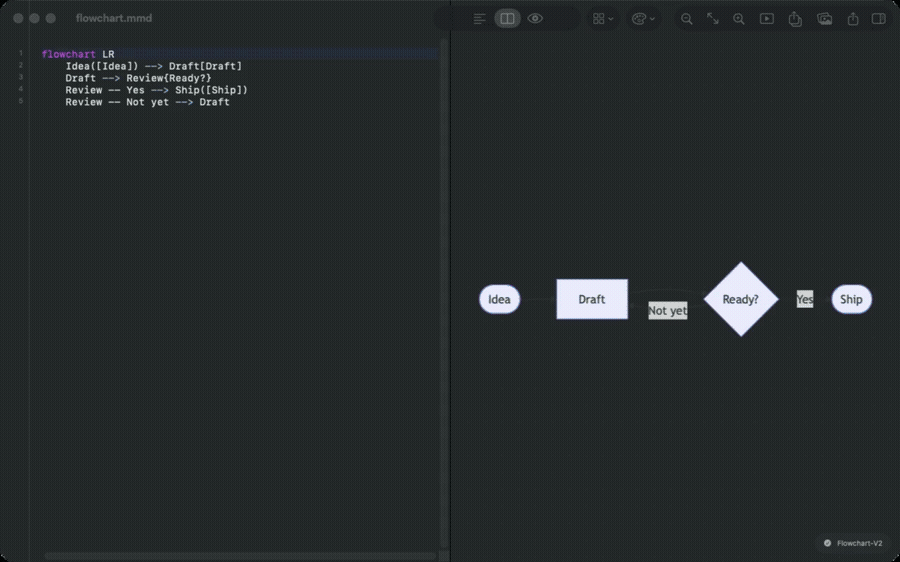
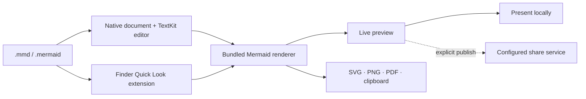

<p align="center">
  
</p>

<h1 align="center">Meditor</h1>

<p align="center">
  A focused, native Mermaid editor for macOS.<br>
  Write diagrams, preview them instantly, and keep the whole workflow close to your code.
</p>

<p align="center">
  <a href="README.pt-BR.md">Português brasileiro</a>
  ·
  <a href="https://addodelgrossi.github.io/meditor/">Website</a>
  ·
  <a href="https://github.com/addodelgrossi/meditor/releases/latest">Download</a>
</p>

<p align="center">
  
  
  
  
</p>

<p align="center">
  
</p>

Meditor treats Mermaid diagrams like native Mac documents. It combines a precise
text editor, an offline renderer, Finder Quick Look, rich export, presentations,
and developer-oriented diagram inspection in one open-source app.

## Why Meditor?

- **Native documents** — `.mmd` and `.mermaid` files with autosave, undo, recent files, and multiple windows
- **Fast local rendering** — live preview, pan, zoom, themes, and last-valid-preview recovery
- **Finder Quick Look** — select a Mermaid file and press Space without opening the app
- **Developer tooling** — syntax highlighting, completion, inline errors, outline inspection, issue detection, and safe identifier renaming
- **Useful output** — SVG, retina PNG, PDF, Markdown blocks, and a rich multi-format image clipboard
- **Present and share** — build temporary multi-file decks or explicitly publish an expiring view-only link
- **Private by default** — editing, rendering, Quick Look, and export run locally; publishing is optional and user-initiated

## Install

Download the notarized DMG from the
[latest GitHub Release](https://github.com/addodelgrossi/meditor/releases/latest).
Meditor currently requires **macOS 26 or newer**.

## Build locally

Local builds use ad hoc signing and do not require an Apple Developer account.

```bash
git clone https://github.com/addodelgrossi/meditor.git
cd meditor
./script/build_and_run.sh
```

The generated app is placed at `dist/Meditor.app`.

## Architecture



Mermaid 11.15.0 is vendored inside the repository. The app and Quick Look
extension render diagrams with bundled resources. Only the explicit Publish
action sends diagram source, theme, a social preview image, and expiry choice
to the configured share service.

## Develop

```bash
swift build
swift test
./script/generate_project.sh
./script/build_and_run.sh --verify
./script/verify_quicklook.sh
```

Read [CONTRIBUTING.md](CONTRIBUTING.md) for project structure, localization, and
media workflows. Distribution and tagged release operations live in
[RELEASING.md](RELEASING.md).

## Contributing

Issues and pull requests are welcome. Please run `swift test` and
`./script/validate_store_assets.sh` before opening a pull request that changes
the app, documentation, localization, or distribution assets.

## License

Meditor is available under the [MIT License](LICENSE). Mermaid is bundled under
its own MIT license in
`Sources/Meditor/Resources/Mermaid/LICENSE-mermaid.txt`.
