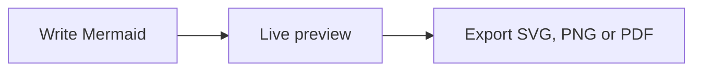

<p align="center">
  
</p>

<h1 align="center">Meditor</h1>

<p align="center">
  A focused, native Mermaid editor for macOS.<br>
  Write diagrams, preview them instantly, and export without leaving your Mac.
</p>

<p align="center">
  
  
  
</p>

## Why Meditor?

Meditor keeps Mermaid editing simple: native documents on the left, a sharp live
preview on the right, and no account or internet connection required.



## Highlights

- Native `.mmd` and `.mermaid` documents with autosave, undo, and multiple windows
- TextKit editor with syntax highlighting, line numbers, completion, and inline errors
- Crisp offline preview with pan, zoom, themes, and last-valid-preview recovery
- Templates for flowcharts, sequences, classes, states, ER, Gantt, mindmaps, and architecture
- SVG, PNG, and PDF export, plus clipboard support
- English and Brazilian Portuguese interface

## Getting Started

Meditor currently requires **macOS 26 or newer** and the Swift toolchain included
with Xcode 26.

```bash
git clone https://github.com/addodelgrossi/meditor.git
cd meditor
./script/build_and_run.sh
```

The generated application is placed at `dist/Meditor.app`.

## Canvas Controls

| Action | Control |
| --- | --- |
| Move around the canvas | Drag or scroll |
| Zoom | Toolbar controls or `Command` + scroll |
| Fit diagram | Double-click the canvas or press `Command + 0` |
| Switch layout | `Command + Option + 1`, `2`, or `3` |
| Export SVG | `Command + Shift + E` |

## Development

```bash
swift build
swift test
./script/build_and_run.sh --verify
```

Mermaid 11.15.0 is vendored for private, offline rendering. Update it with:

```bash
./script/update_mermaid.sh 11.15.0
```

Meditor stores diagram source as plain text. Rendering happens locally and
document content never leaves the device.
