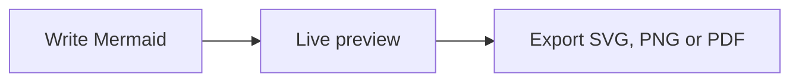

<p align="center">
  
</p>

<h1 align="center">Meditor</h1>

<p align="center">
  A focused, native Mermaid editor for macOS.<br>
  Write diagrams, preview them instantly, and export without leaving your Mac.
</p>

<p align="center">
  
  
  
</p>

<p align="center">
  
</p>

## Why Meditor?

Meditor keeps Mermaid editing simple: native documents on the left, a sharp live
preview on the right, and no account or internet connection required.



## Highlights

- Native `.mmd` and `.mermaid` documents with autosave, undo, and multiple windows
- Finder Quick Look previews: select a Mermaid file and press Space
- TextKit editor with syntax highlighting, line numbers, completion, and inline errors
- Crisp offline preview with pan, zoom, themes, and last-valid-preview recovery
- Templates for flowcharts, sequences, classes, states, ER, Gantt, mindmaps, architecture, and C4 context diagrams
- Rich SVG, retina PNG, and PDF export with theme and background controls
- Welcome hub with recent documents, blank diagrams, and built-in templates
- One-click smart image clipboard with SVG, PDF, PNG, and TIFF representations
- Full-screen presentations with temporary multi-file decks, slide navigation, and node highlighting
- Publish a view-only link with auto-expiry and a social preview (powered by
  [meditor-cloud](https://github.com/addodelgrossi/meditor-cloud)); manage or
  unpublish your links from the Diagram menu
- English and Brazilian Portuguese interface

## Getting Started

Meditor currently requires **macOS 26 or newer** and the Swift toolchain included
with Xcode 26.

```bash
git clone https://github.com/addodelgrossi/meditor.git
cd meditor
./script/build_and_run.sh
```

The generated application is placed at `dist/Meditor.app`.

## Canvas Controls

| Action | Control |
| --- | --- |
| Move around the canvas | Drag or scroll |
| Zoom | Toolbar controls or `Command` + scroll |
| Fit diagram | Double-click the canvas or press `Command + 0` |
| Switch layout | `Command + Option + 1`, `2`, or `3` |
| Copy image | Toolbar, preview context menu, or `Command + Shift + C` |
| Export with options | `Command + Shift + E` |
| Build presentation | `Command + Shift + Return` |

## Presentation Controls

| Action | Control |
| --- | --- |
| Previous / next slide | Arrow keys, or `Space` to advance |
| Highlight a node | Click the node |
| Clear node highlight | Click the canvas |
| Zoom | `+` / `-`, toolbar controls, or `Command` + scroll |
| Fit diagram | `0` or double-click the canvas |
| End presentation | `Escape` |

## Development

```bash
swift build
swift test
./script/generate_project.sh
./script/build_and_run.sh --verify
./script/verify_quicklook.sh
```

Mermaid 11.15.0 is vendored for private, offline rendering. Update it with:

```bash
./script/update_mermaid.sh 11.15.0
```

Meditor stores diagram source as plain text. Rendering happens locally and
document content never leaves the device.

## Mac App Store Distribution

The checked-in Xcode project is generated from `project.yml` and shares the
same sources and tests as the Swift package.

```bash
brew install xcodegen
./script/validate_store_assets.sh
./script/archive.sh
./script/validate_app_store.sh
./script/upload_testflight.sh --confirm-upload
```

The upload command requires the App Store Connect record for
`com.addodelgrossi.meditor` and valid agreements for the `ADDO DEL GROSSI`
team; App Store validation requires the same record. Increment
`CURRENT_PROJECT_VERSION` in
`Configuration/Meditor.xcconfig` before every upload.

### Tagged App Store uploads

Pushing a semantic-version tag such as `v1.0.1` runs
`.github/workflows/app-store.yml`. The workflow tests the tagged commit,
archives it with version `1.0.1`, validates it, and uploads a uniquely numbered
build to App Store Connect. It does not submit the version for App Review or
release it publicly.

Configure an `app-store-connect` GitHub environment with these secrets:

- `APP_STORE_CONNECT_API_KEY_ID`: App Store Connect API key ID
- `APP_STORE_CONNECT_API_ISSUER_ID`: App Store Connect issuer ID
- `APP_STORE_CONNECT_API_KEY_P8`: complete contents of the downloaded `.p8`
  private key

Create an Admin team API key in App Store Connect under **Users and Access >
Integrations**, and keep the downloaded private key only in the GitHub
environment secret. Then publish the next build with:

```bash
git tag v1.0.1
git push origin v1.0.1
```

Privacy and support pages live in `docs/` and deploy through GitHub Pages.
App Store metadata and screenshot guidance live in `AppStore/`. Screenshot
automation requires Screen & System Audio Recording permission for Codex or
Terminal. The remaining account and submission steps are tracked in
`AppStore/RELEASE_CHECKLIST.md`.

Regenerate the Finder Quick Look demo and its MP4, GIF, and poster assets with:

```bash
./script/capture_quicklook_demo.sh
```

## License

Meditor is available under the [MIT License](LICENSE). Mermaid is bundled
under its own MIT license in
`Sources/Meditor/Resources/Mermaid/LICENSE-mermaid.txt`.
