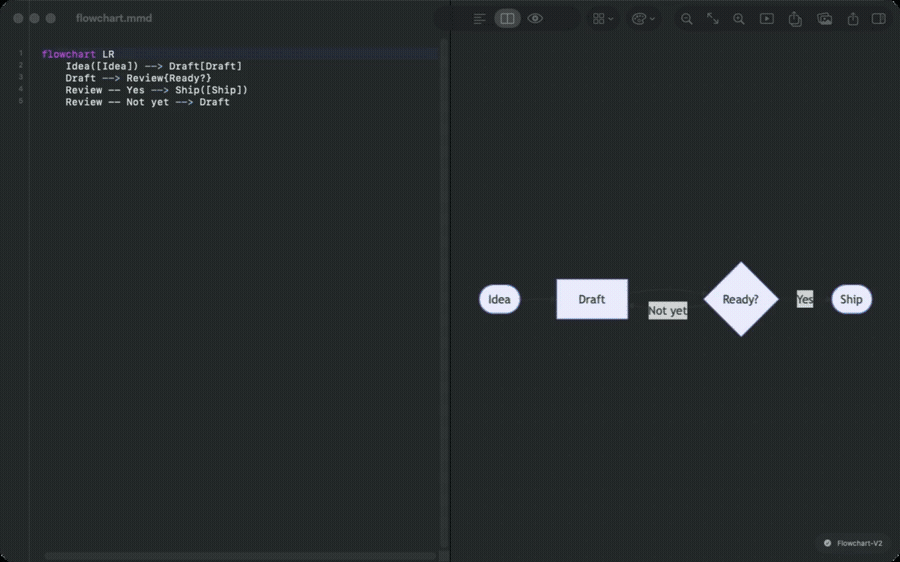
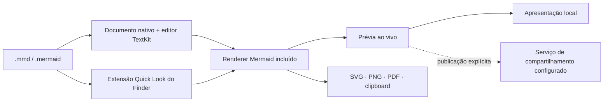

<p align="center">
  
</p>

<h1 align="center">Meditor</h1>

<p align="center">
  Um editor Mermaid nativo e focado para macOS.<br>
  Escreva diagramas, visualize o resultado na hora e mantenha todo o fluxo perto do código.
</p>

<p align="center">
  <a href="README.md">English</a>
  ·
  <a href="https://addodelgrossi.github.io/meditor/pt-BR/">Site</a>
  ·
  <a href="https://github.com/addodelgrossi/meditor/releases/latest">Download</a>
</p>

<p align="center">
  
  
  
  
</p>

<p align="center">
  
</p>

O Meditor trata diagramas Mermaid como documentos nativos do Mac. Ele reúne um
editor de texto preciso, renderização offline, Quick Look no Finder, exportação
rica, apresentações e ferramentas de inspeção para desenvolvedores em um único
aplicativo de código aberto.

## Por que Meditor?

- **Documentos nativos** — arquivos `.mmd` e `.mermaid` com salvamento automático, desfazer, recentes e múltiplas janelas
- **Renderização local rápida** — prévia ao vivo, movimento, zoom, temas e recuperação da última prévia válida
- **Quick Look no Finder** — selecione um arquivo Mermaid e pressione Espaço sem abrir o app
- **Ferramentas para desenvolvimento** — destaque de sintaxe, sugestões, erros em linha, inspeção da estrutura, detecção de problemas e renomeação segura
- **Saídas úteis** — SVG, PNG retina, PDF, blocos Markdown e área de transferência com múltiplos formatos
- **Apresente e compartilhe** — monte decks temporários ou publique explicitamente um link somente leitura com expiração
- **Privado por padrão** — edição, renderização, Quick Look e exportação são locais; publicar é opcional e iniciado pelo usuário

## Instalação

Baixe o DMG notarizado na
[GitHub Release mais recente](https://github.com/addodelgrossi/meditor/releases/latest).
O Meditor atualmente requer **macOS 26 ou posterior**.

## Build local

Builds locais usam assinatura ad hoc e não exigem uma conta Apple Developer.

```bash
git clone https://github.com/addodelgrossi/meditor.git
cd meditor
./script/build_and_run.sh
```

O aplicativo gerado fica em `dist/Meditor.app`.

## Arquitetura



O Mermaid 11.15.0 está incluído no repositório. O app e a extensão Quick Look
renderizam diagramas com recursos locais. Somente a ação explícita Publicar
envia o código do diagrama, tema, imagem de prévia social e escolha de expiração
ao serviço de compartilhamento configurado.

## Desenvolvimento

```bash
swift build
swift test
./script/generate_project.sh
./script/build_and_run.sh --verify
./script/verify_quicklook.sh
```

Leia [CONTRIBUTING.md](CONTRIBUTING.md) para conhecer a estrutura do projeto,
localização e fluxos de mídia. Operações de distribuição e releases com tags
estão em [RELEASING.md](RELEASING.md).

## Como contribuir

Issues e pull requests são bem-vindos. Execute `swift test` e
`./script/validate_store_assets.sh` antes de abrir um pull request que altere o
app, documentação, localização ou assets de distribuição.

## Licença

O Meditor está disponível sob a [licença MIT](LICENSE). O Mermaid incluído usa
sua própria licença MIT em
`Sources/Meditor/Resources/Mermaid/LICENSE-mermaid.txt`.
